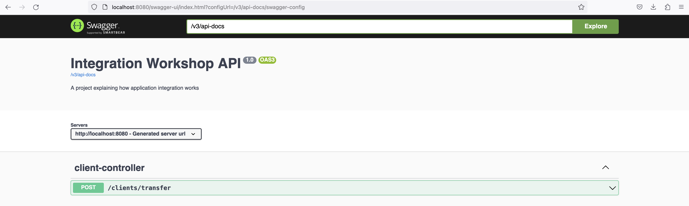
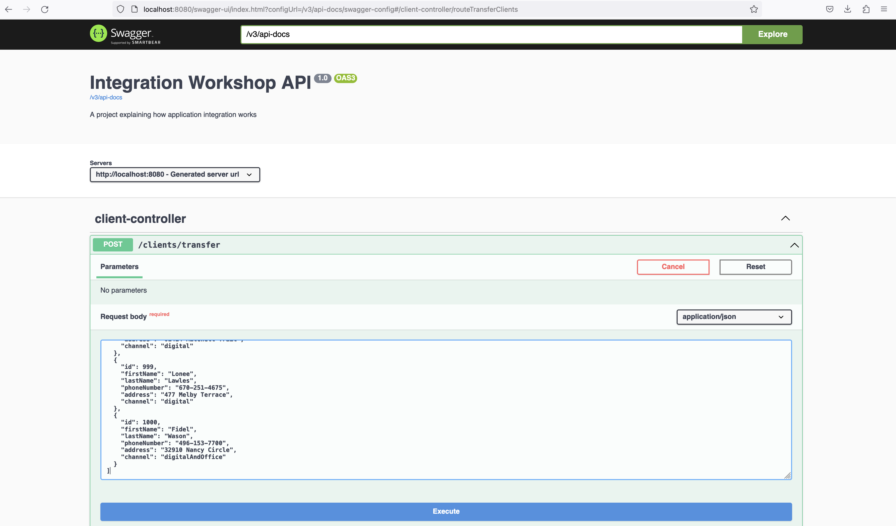
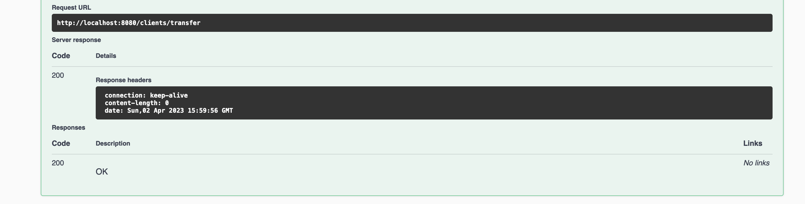
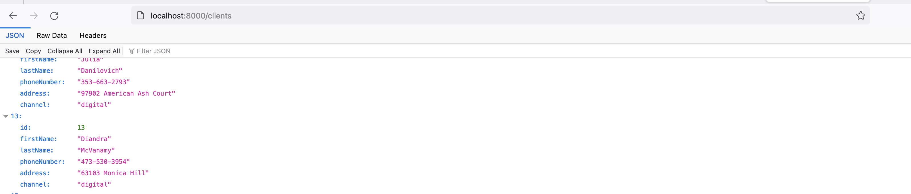

<h1 style="text-align: center;">Integration Enterprise workshop</h1>

<p align="center">
  
    
  
  
  
  
</p>

> Developed by: Bryam Vega


## 🏙️ Problem

The company XYZ has had a constant growth, from having one office to 20 offices throughout the country, in addition to opening presence on platforms to massify their products and attract more customers using Facebook and WhatsApp for businesses, where it has also had a great reception; they use the commercial version in the cloud of the manufacturer of Odoo, reducing the problems of slowness and intermittency that had between the different offices, in order to manage in an appropriate way to the large number of customers that the company currently has, they have used the CRM module with good results.

Due to commercial relations, the company became part of a consortium or group with the purpose of generating business among the companies of the group, so that within the group there are specialized companies to manage customer profiles according to the customer's purchasing preference.

* Company XYZ has already profiled its customers through the CRM module.
* Company 123 is a company specialized in managing customers whose online shopping profile are customers who make all their transactions only through digital channels.
* The ABC company specializes in handling customers who, although they are approached online, prefer to make their purchases and transactions through face-to-face channels such as offices.

An online solution is needed to pass XYZ company customers to 123 and ABC companies according to the customer's purchase channel profile, 123 and ABC companies use different information systems or platforms, they have developed a web service to receive customer information from XYZ company, they have agreed to exchange the information in JSON form.

Develop a proof-of-concept solution that allows to create a scenario that simulates the environment described above, using an integration framework as well as an integration pattern that allows to transmit customer information.

## 💻 Development

### Main process : `enterprise-xyz-integration`


This project contains the main process of transferring information to the services of the companies `abc` and `123`. To perform this integration we used the `apache camel` framework with spring boot.


Additional swagger was used which is opened in the following link `http://localhost:8080/swagger-ui/index.html` with the objective of accessing the client transfer service.

### First service : `enterprise-abc-integration`


This project contains the webservice to register `abc`digital and office customers and is developed in `NestJs` framework. For the moment and for practical purposes, this webservice only saves the information in memory, so when restarting the whole project the information will be lost.

### Second service: `enterprise-123-integration`


This project contains the webservice to register `123` digital customers and is developed in `Fast API` framework. For the moment and for practical purposes, this webservice only saves the information in memory, so when restarting the whole project the information will be lost.


## 🔥 How to run


#### Compile `Dockerfile` projects

* `enterprise-xyz-integration`


```shell
$ cd enterprise-xyz-integration
$ mvn clean package
$ mvn clean install
$ docker build -t enterprise-xyz-integration .
```

* `enterprise-abc-integration`

```shell
$ cd enterprise-abc-integration
$ npm install
$ docker build -t enterprise-abc-integration .
```

* `enterprise-123-integration`

```shell
$ cd enterprise-123-integration
$ docker build -t enterprise-123-integration .
```

#### Execute `docker-compse.yaml`

```shell
$ docker-compose up
```

❗️You must have an outup like this:❗️

```shell
[+] Running 3/0
 ⠿ Container company-123  Created                                                                                                                                                                                                                        0.0s
 ⠿ Container company-abc  Created                                                                                                                                                                                                                        0.0s
 ⠿ Container company-xyz  Created                                                                                                                                                                                                                        0.0s
Attaching to company-123, company-abc, company-xyz
company-123  | INFO:     Started server process [1]
company-123  | INFO:     Waiting for application startup.
company-123  | INFO:     Application startup complete.
company-123  | INFO:     Uvicorn running on http://0.0.0.0:8000 (Press CTRL+C to quit)
company-abc  | 
company-abc  | > enterprise-abc-integration@0.0.1 start:prod /app
company-abc  | > node dist/main
company-abc  | 
company-abc  | [Nest] 18  - 04/02/2023, 3:44:12 PM     LOG [NestFactory] Starting Nest application...
company-abc  | [Nest] 18  - 04/02/2023, 3:44:12 PM     LOG [InstanceLoader] AppModule dependencies initialized +18ms
company-abc  | [Nest] 18  - 04/02/2023, 3:44:12 PM     LOG [RoutesResolver] AppController {/clients}: +16ms
company-abc  | [Nest] 18  - 04/02/2023, 3:44:12 PM     LOG [RouterExplorer] Mapped {/clients, GET} route +4ms
company-abc  | [Nest] 18  - 04/02/2023, 3:44:12 PM     LOG [RouterExplorer] Mapped {/clients, POST} route +1ms
company-abc  | [Nest] 18  - 04/02/2023, 3:44:12 PM     LOG [NestApplication] Nest application successfully started +3ms
company-xyz  | 
company-xyz  |   .   ____          _            __ _ _
company-xyz  |  /\\ / ___'_ __ _ _(_)_ __  __ _ \ \ \ \
company-xyz  | ( ( )\___ | '_ | '_| | '_ \/ _` | \ \ \ \
company-xyz  |  \\/  ___)| |_)| | | | | || (_| |  ) ) ) )
company-xyz  |   '  |____| .__|_| |_|_| |_\__, | / / / /
company-xyz  |  =========|_|==============|___/=/_/_/_/
company-xyz  |  :: Spring Boot ::                (v2.4.2)
company-xyz  | 
company-xyz  | 2023-04-02 15:44:12.974  INFO 1 --- [           main] e.e.u.msoft.xyz.MySpringBootApplication  : Starting MySpringBootApplication using Java 17.0.6 on company-xyz with PID 1 (/app/app.jar started by root in /app)
 1389 ms
... more info
company-xyz  | 2023-04-02 15:44:16.761  INFO 1 --- [           main] o.a.c.impl.engine.AbstractCamelContext   : Apache Camel 3.8.0 (MyCamel) started in 521ms (build:38ms init:477ms start:6ms)
company-xyz  | 2023-04-02 15:44:16.766  INFO 1 --- [           main] e.e.u.msoft.xyz.MySpringBootApplication  : Started MySpringBootApplication in 4.254 seconds (JVM running for 4.747)
```

## 🕹️ How to use

Enter the enterprise-xyz-integration project swagger through the link [swagger](http://localhost:8080/swagger-ui.html) and you will get the following result:



In the only client service enter the json that is in a file called `mockdata.json` and put it as part of the body of the post service. The result should be the following:



Execute the service and we will get the following answer: 



We verify if the data was entered correctly in the services by accessing the following links:

* [verify abc clients](http://localhost:3000/clients)
* [verify 123 clients](http://localhost:8000/clients)

You have a result like this:




